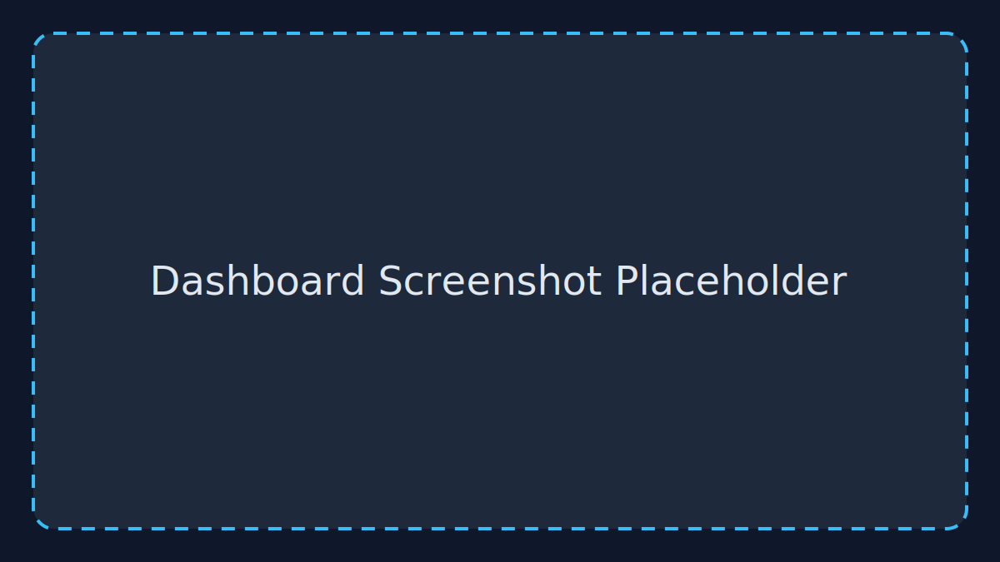
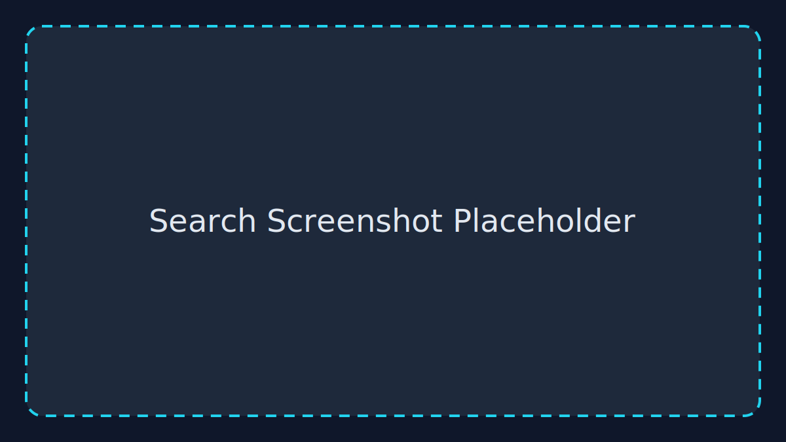
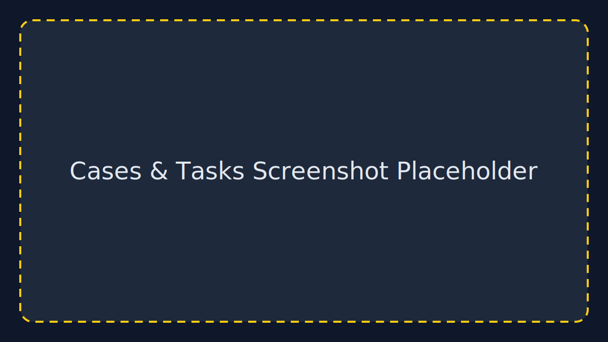
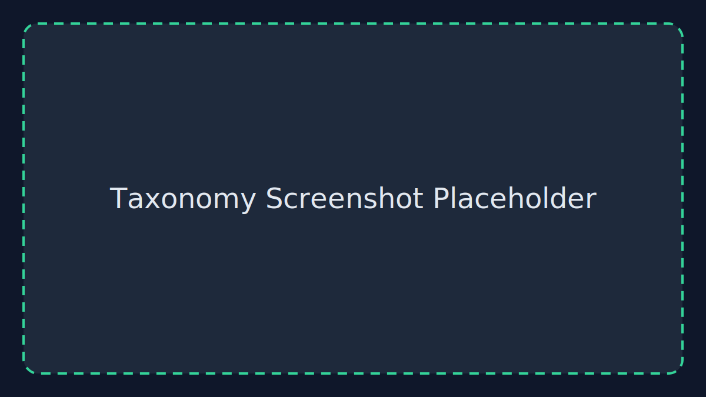
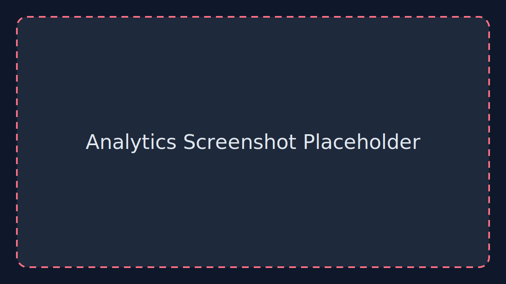

# Analyst Console User Guide

_Last updated: 2025-11-19_

This guide walks through the current analyst console experience. Screenshots are represented by placeholders until final imagery is captured from staging.

## Accessing the Console

1. Install dependencies and start the development server (see `docs/developer-guide.md`).
2. Visit http://localhost:3000 to load the console. The root route redirects to the Dashboard.
3. Use the left navigation rail to switch between Dashboard, Search, Cases & Tasks, Taxonomy, and Analytics.

> **Tip:** By default the console uses built-in mock data, so you can explore every workflow without connecting to the backend. Set `NEXT_PUBLIC_USE_MOCK_DATA=false` to interact with live FastAPI endpoints.

## Dashboard

- **Today’s overview:** Quick stats on active investigations, new leads, cases at risk, and policy exceptions.
- **Alerts & escalations:** High-signal events surface here. Click “View details” to jump into cases (link stub for now).
- **Activity feed:** Recent updates from automated systems and human operators.
- **Reminders:** Action prompts grouped by coordination, legal, data, or alerts.
- **Quick actions:** Deep links into Search, Cases, and Taxonomy workflows.

### Common Tasks

- Acknowledge new alerts and review their context.
- Scan reminders to keep workstreams on schedule.
- Use Quick Actions to jump back into your primary queue.

## Search

- **Search bar:** Look up entities, behaviours, or case IDs. Submit to refresh results.
- **Facets:** Toggle source/taxonomy chips to narrow scope. Selected filters are highlighted.
- **Result cards:** Show source, timestamp, relevance score, confidence, and tags.
- **Suggestions & stats:** Display total hits, query latency, and recommended searches.

### Common Tasks

- Investigate a lead by querying a person, organisation, or location.
- Narrow results to a specific source (e.g., customs filings) or taxonomy label.
- Review tags to identify related cases or potential escalation paths.

## Cases & Tasks

- **Summary tiles:** High-level counts (active, escalations, due today, pending review).
- **Case list:** Each entry shows priority, status, queue, owner, tags, progress bar, and due date.
- **Queues panel:** Overview of workload distribution across queues.

### Common Tasks

- Identify priorities at risk using the “Cases at risk” metric on the Dashboard, then drill into details here.
- Reassign ownership or escalate cases that are blocked (future enhancement).
- Export status snapshots for cross-team coordination (button placeholder currently).

## Taxonomy

- **Taxonomy tree:** Hierarchical view of fraud/abuse categories with counts.
- **Steward information:** Displays the owning team and last update timestamp.
- **Actions:** “Add taxonomy node” and “Propose change” buttons (wiring pending) guide change management.

### Common Tasks

- Review category definitions prior to tagging new cases.
- Identify high-volume areas needing subcategory refinement.
- Coordinate with the steward team for adjustments.

## Analytics

- **KPI tiles:** Detection rate, median time to action, proactive interventions, and SLA adherence.
- **Detection rate chart:** Daily performance trend (line chart).
- **Pipeline throughput:** Stage-by-stage volume (bar chart).
- **Weekly incidents vs interventions:** Compare case volume and successful interventions (area chart).
- **Geography coverage:** Regional distribution of detected incidents (horizontal bar chart).

### Common Tasks

- Monitor KPIs to ensure the programme stays within SLAs.
- Share weekly trend reports with leadership or partners.
- Identify regions or pipeline stages requiring additional resourcing.

## Help & Support

- Each page links to relevant documentation via the help button in the navigation footer.
- For issues or feature requests, create an issue in the `ui` repository and cc the design or backend leads as needed.

## Intelligence Hub (Sprints 2–6)

The Intelligence section provides advanced threat analysis tools:

### Entity Explorer

Browse, search, and filter threat entities (wallets, emails, phone numbers, domains). Each entity detail page shows:

- Co-occurrence graph with related entities
- Activity sparkline showing detection trend
- Blockchain enrichment data for wallet entities (risk label, transaction volume, exchange attribution)
- Wallet cluster edges from on-chain analysis

### Indicator Registry

Segmented indicator list with category tabs (URL, email, phone, wallet, domain). Supports bulk actions, confidence filters, and STIX 2.1 or CSV export.

### Network Graph

Interactive force-directed graph visualization:

- **Temporal animation** — Date-slider to see how the network evolved over time
- **Louvain clustering** — Color-coded community detection with cluster density metrics
- **Infrastructure edges** — Shared hosting, IP, registrar relationships (blue dashed)
- **Wallet cluster edges** — Blockchain-derived wallet groupings (gold thick)

### Campaigns

Campaign management with taxonomy rollup, risk scoring, and member case aggregation. Each campaign shows referral status across member cases and links to the governance taxonomy.

### Timeline

Chronological event view with entity highlighting, date-range filtering, and drill-down to case detail.

## Impact Dashboard (Sprint 6 enhancements)

- **Mobile-responsive layout** — KPI grid displays 2 columns on mobile, 4 columns on desktop.
- **KPI sparkline cards** — Inline trend sparklines on each KPI tile for at-a-glance trend visibility.
- **Campaign alerts** — Mobile-friendly campaign alert list sorted by most recently updated.
- **Responsive charts** — Chart heights adjust for small screens (`h-60` mobile, `h-80` desktop).

## Reports

### Report Builder

Select a template (Standard Dossier or LEA Evidence Dossier), define the scope, and generate a report. LEA dossiers include blockchain enrichment data and chain-of-custody verification.

### Report Library

Browse generated reports, download artifacts, and verify SHA-256 signatures.

Once screenshot assets are ready, replace the placeholder SVGs under `apps/web/public/placeholders/` and update this guide with real imagery.
